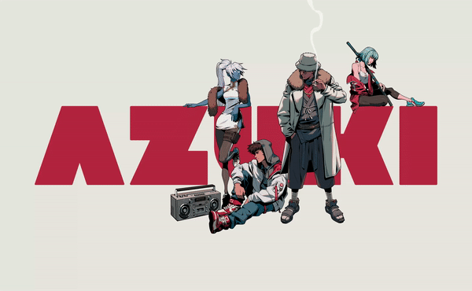
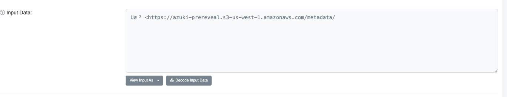
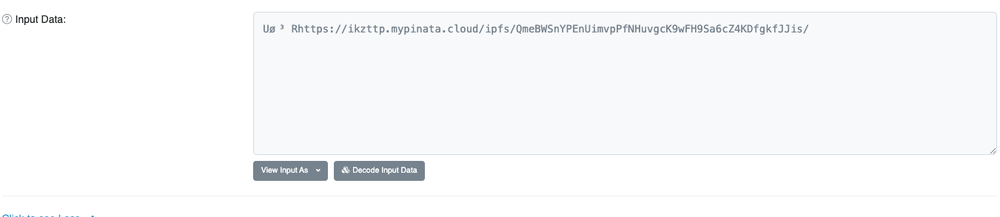

# How do NFT reveals work? Azuki as an example

[Azuki](https://www.azuki.com/) is an NFT collection that's created a lot of hype recently. It's been the #1 NFT project on OpenSea for over a week, beating BAYC and CryptoPunks for the top spot.  



As a developer learning more about the crypto ecosystem and launching projects for [Atomic](https://atomic.vc/)'s new portfolio companies, I wanted to share what I learned diving into how Azuki's NFT launch works. 

## High level overview of Azuki's launch

Azuki minted NFT's that were later revealed. 

On Jan 10th, you could mint an Azuki NFT during it's public sale. The NFT's started as this: 


On Jan 20th 2022, they turned into an Azuki avatar: 


## NFT basics
An NFT is a JSON document that contains information about the name, description, image, and attributes of the NFT. An Azuki NFT looks like this: 

```JSON
{
  "name": "Azuki #111",
  "image": "https://ikzttp.mypinata.cloud/ipfs/QmYDvPAXtiJg7s8JdRBSLWdgSphQdac8j1YuQNNxcGE1hg/111.png",
  "attributes": [
    { "trait_type": "Type", "value": "Human" },
    { "trait_type": "Hair", "value": "Black Fluffy" },
    { "trait_type": "Ear", "value": "Wu" },
    { "trait_type": "Clothing", "value": "Light Kimono" },
    { "trait_type": "Eyes", "value": "Careless" },
    { "trait_type": "Mouth", "value": "Relaxed" },
    { "trait_type": "Background", "value": "Off White A" }
  ]
}
```

This NFT is usually hosted on an *IMMUTABLE* storage service like [IPFS](https://ipfs.io/). In Azuki's base, it is being hosted by [Pinata](https://www.pinata.cloud/).

I used to think the reason why NFTs were valuable is because they cannot be changed and live on the blockchain. But I know understand it to be because of the fact that the files that represent the NFTs cannot change. 

For example, if I hosted an NFT on AWS, I could go into AWS and change those files whenever I like. This is not the case with IPFS (if I'm wrong about this please let me know!)

To make it truly decentralized, I've seen projects store NFTs in the smart contract itself using a small amount of SVG code. This is extremely expensive. Especially in a world where NFTs are becoming more complex, incorporating 3D and video. 

# Azuki's reveal process
On Jan 10th, Azuki's created the NFT contract. [Here](https://etherscan.io/tx/0x1c2d63247c36a617775c435a917770dfe62379064deaa1ab7f85e651a92f578e) is the transaction for it. 

The first transaction that was run by the Azuki team was to set the Base URI for the NFTs. The Base URI is essentially the link that points to the JSON file that includes the link to the NFT image. [Here](https://etherscan.io/tx/0x67d8b0aa074e40fd82427782ccb4f86e3a26870d34909624dc8612ca781e6e29) is the transaction. 

What's ineteresting is that these NFTs were hosted on AWS. 



On Jan 20th, around 8 pm UTC, Azuki's team revealed the NFT by overriding the Base URI for the NFT. [Transaction link](https://etherscan.io/tx/0xdc4c1524d1118c60fb1862ba6300d43c0cf62379d6ab1e855c72e5d6d906473a). This is what the input looked like for that transaction. 



# Benefits of Azuki method
There is no way for bots (at least that I can think of) to reverse engineer which NFTs pre-reveal will be associated with NFTs that have rare attributes. 

# Questions about the Azuki method
The Azuki team seemed to control which IDs were associated with the revealed NFTs. I couldn't find anything in their technical documentation that described how they ensured random assignment of the NFTs. If you understand this, please let me know. However, if this is in fact true, it seems like this reveal was not fair. 

# Further reading
- [Opensea's guide to NFTs](https://opensea.io/blog/guides/non-fungible-tokens/)
- [Paradigms's guide to NFT launches](https://www.paradigm.xyz/2021/10/a-guide-to-designing-effective-nft-launches/)
- [Step 1 to learning how to be a blockchain dev IMO](https://cryptozombies.io/)
- [Step 2 to learning how to be a blockchain dev IMO](https://buildspace.so/)
